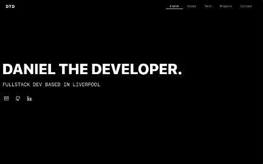

# Daniel The Developer - Portfolio Website

A modern, responsive portfolio website built with React, TypeScript, and Tailwind CSS showcasing my skills, projects, and professional background.

## 🚀 Live Demo

Visit the live website: [danielthedeveloper.vercel.app](https://danielthedeveloper.vercel.app)

## ✨ Features

- **Responsive Design** - Fully optimized for all device sizes
- **Modern UI/UX** - Clean and professional interface with smooth animations
- **Project Showcase** - Highlighting my work with links to live demos and GitHub repos
- **Tech Stack Display** - Organized presentation of technical skills by category
- **Contact Form** - Direct communication channel for potential clients and employers
- **Dark Mode Navigation** - Enhanced user experience with context-aware navigation

## 🛠️ Built With

- [React](https://reactjs.org/) - Frontend library
- [TypeScript](https://www.typescriptlang.org/) - Type-safe JavaScript
- [Tailwind CSS](https://tailwindcss.com/) - Utility-first CSS framework
- [Lucide React](https://lucide.dev/) - Beautiful SVG icons

## 📄 License

This project is licensed under the MIT License - see the [LICENSE](LICENSE) file for details.

## 👤 Author

**Daniel Tanurhan**

- Website: [danielthedeveloper.vercel.app](https://danielthedeveloper.vercel.app)
- GitHub: [@danieltanurhan](https://github.com/danieltanurhan)
- LinkedIn: [@danieltanurhan](https://linkedin.com/in/danieltanurhan)
- Email: danieltanurhan@gmail.com

## 🙏 Acknowledgments

- [React Documentation](https://reactjs.org/docs/getting-started.html)
- [Tailwind CSS](https://tailwindcss.com/docs)
- [Lucide Icons](https://lucide.dev)
- All the amazing open source libraries that made this project possible

---

Made with ❤️ by Daniel Tanurhan
